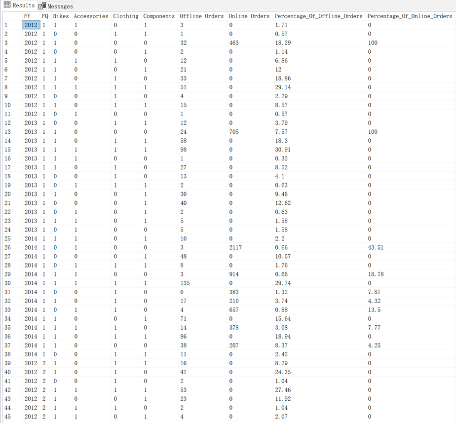
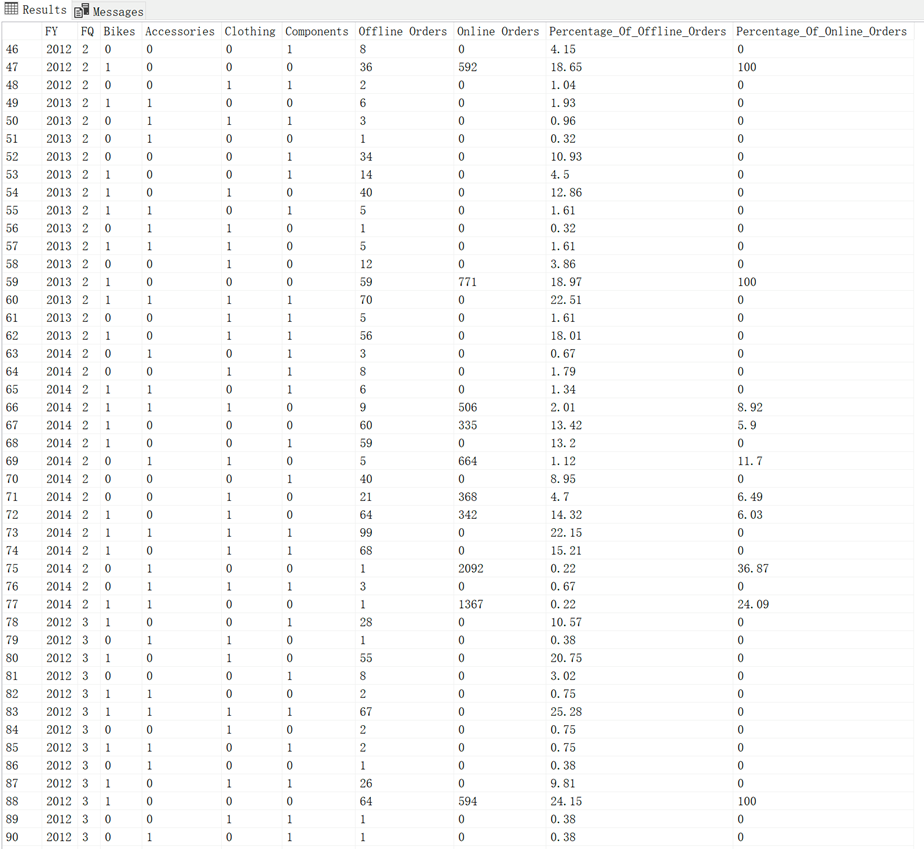
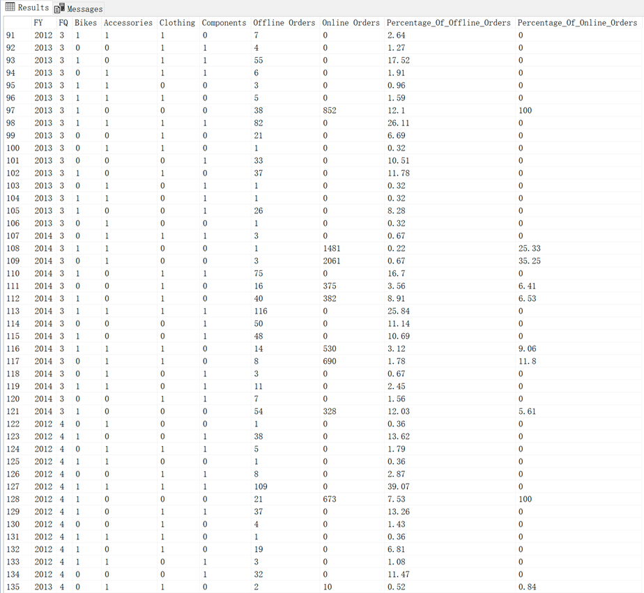
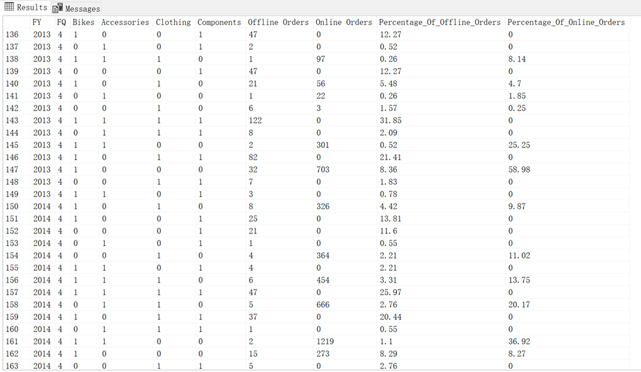
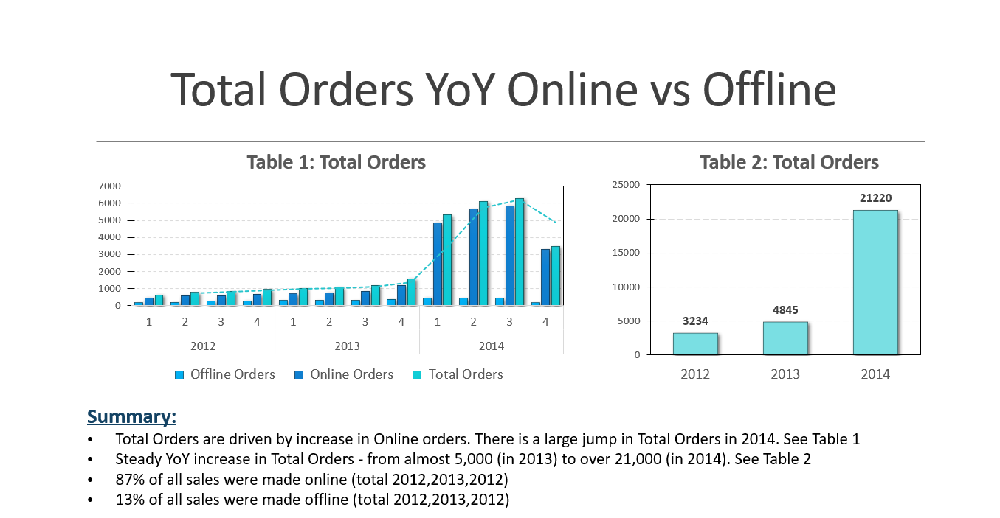
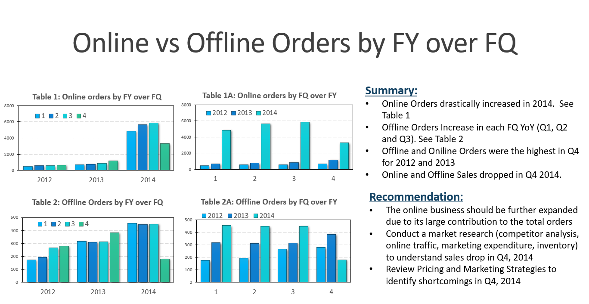
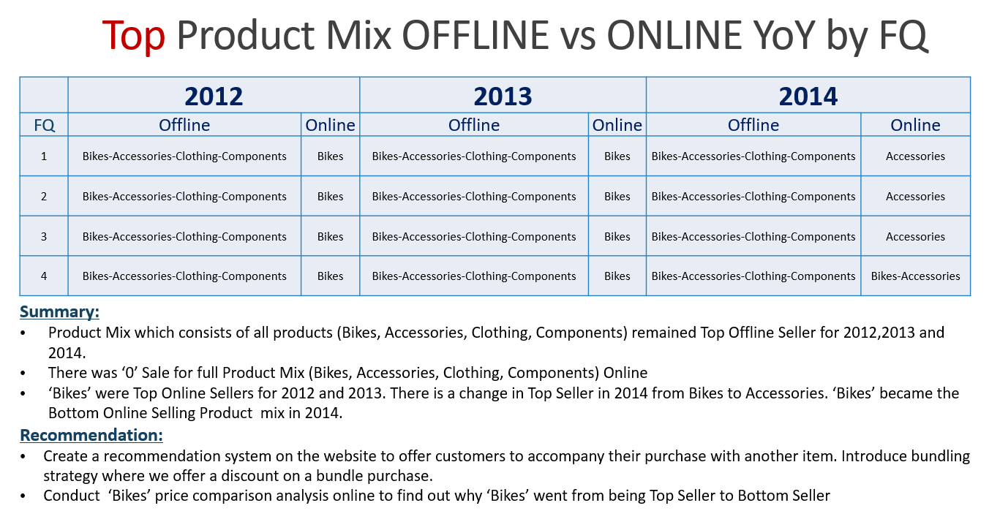
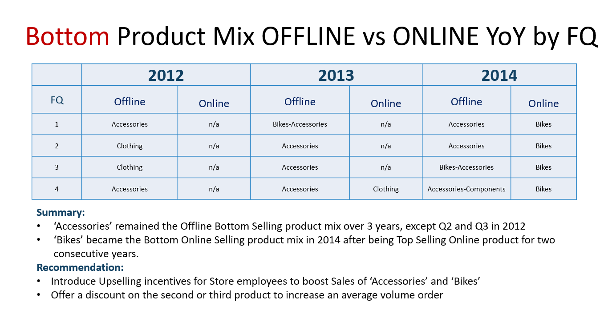

# Adventure Works Cycles-SQL
Market Basket Analysis & Exploratory Data Analysis (EDA) Using SQL

# Task:
1. Conduct a Market Basket Analysis
2. Write a SQL query to create a matrix to list all possible customer-buying patterns of each product category over the period
3. Calculate the percentage of orders for each product mix (including offline and online orders) within each financial quarter of the financial year (2012, 2013, 2014)

# SQL file:
https://github.com/trajceskijovan/Adventure-Works-Cycles---SQL/blob/main/SQL%20query

# Presentation (deck):
https://github.com/trajceskijovan/Adventure-Works-Cycles---SQL/blob/main/Presentation.pdf

# SQL output:

# Insights:

