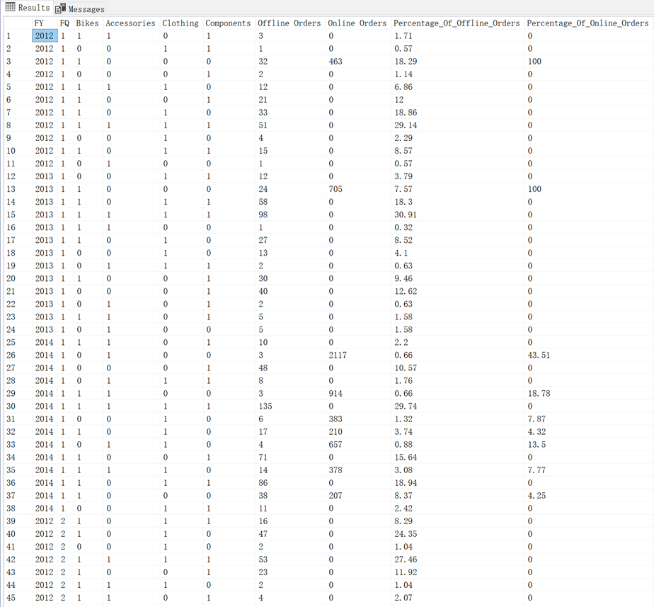
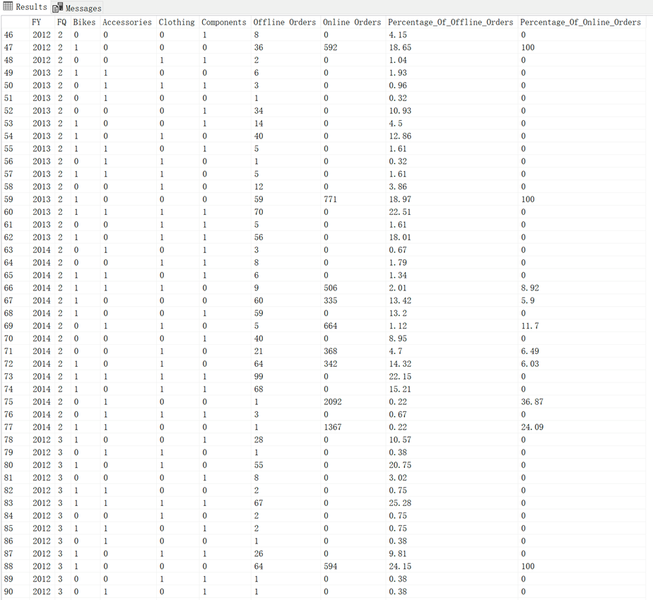
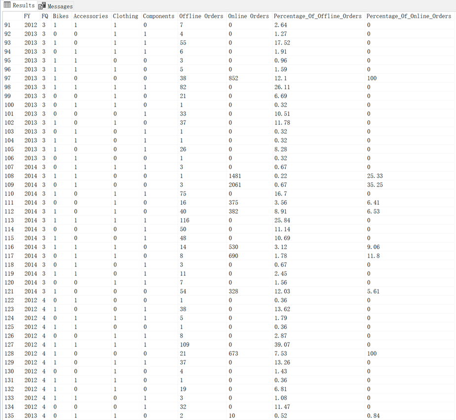
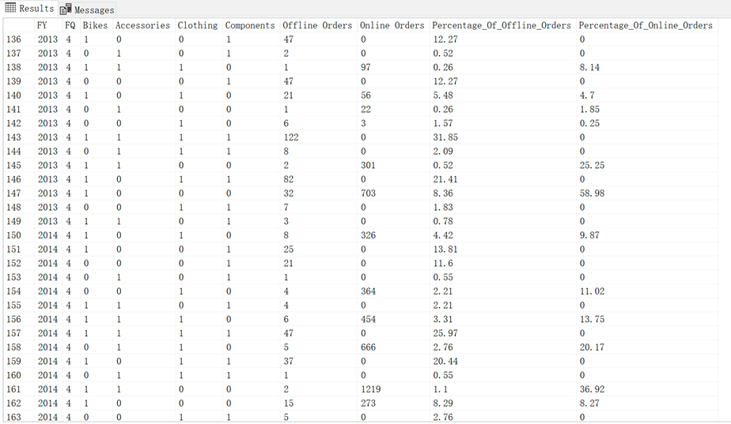

# Adventure Works Cycles-SQL
Exploratory Data Analysis (EDA) Using SQL

# Task:
1. Conduct a Market Basket Analysis
2. Write a SQL query to create a matrix to list all possible customer-buying patterns of each product category over the period
3. Calculate the percentage of orders for each product mix within each financial quarter of the financial year (2012, 2013, 2014)

# SQL output:

# Insights:

